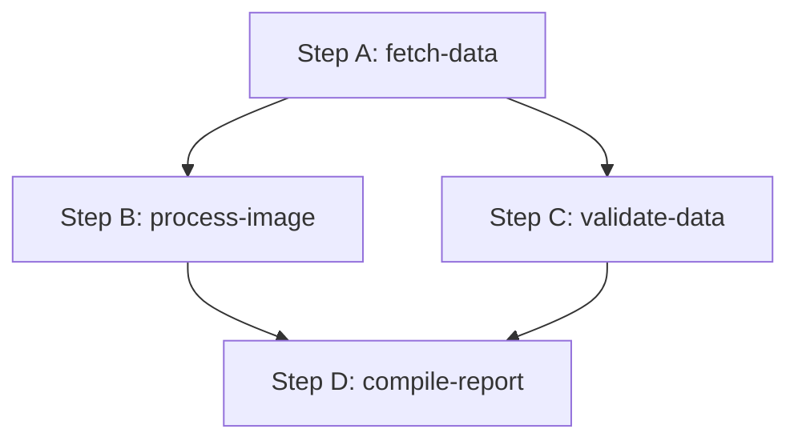

# Dependency Resolution & DAG Processing

JobFlow processes complex pipelines modeled as Directed Acyclic Graphs (DAGs). The execution path is decided dynamically by resolving dependencies and evaluating conditions.

---

## 1. DAG Execution Model

A DAG is a collection of steps where each step can point to one or more dependencies (parents). Cycle detection ensures that circular references are rejected during creation validation.



### Execution Sequence Walkthrough:
1. **Step A** runs first because its `dependsOn` array is empty.
2. When **Step A** completes successfully, the engine schedules **Step B** and **Step C** to run in parallel, since both only depend on `A` and all their parent paths are finished.
3. **Step B** and **Step C** execute simultaneously on separate queue channels/workers.
4. When **both** Step B and Step C reach `COMPLETED` status, **Step D** is scheduled. If B is complete but C is still running, D waits in `PENDING` status.

---

## 2. DAG Dependency Resolution Algorithm

On every evaluation tick, the `DependencyResolver` filters for steps that are eligible to run. A step is ready to execute if:
1. It is currently in a `PENDING` state.
2. It has no dependencies (`dependsOn: []`), OR all step IDs listed in its `dependsOn` array are currently in a `COMPLETED` state in the database.
3. None of its dependencies have transitioned to `FAILED` or `CANCELLED`.

### Code Walkthrough (`dependency.resolver.ts`):
```typescript
public static findReadySteps(steps: WorkflowStep[]): WorkflowStep[] {
  const completedStepIds = new Set(
    steps.filter((s) => s.status === WorkflowStatus.COMPLETED).map((s) => s.stepId)
  );

  const failedOrCancelledStepIds = new Set(
    steps
      .filter((s) => s.status === WorkflowStatus.FAILED || s.status === WorkflowStatus.CANCELLED)
      .map((s) => s.stepId)
  );

  return steps.filter((step) => {
    if (step.status !== WorkflowStatus.PENDING) return false;

    const deps = step.dependsOn || [];
    
    // If a dependency failed or was cancelled, this step cannot run
    if (deps.some((depId) => failedOrCancelledStepIds.has(depId))) {
      return false;
    }

    // All dependencies must be completed
    return deps.every((depId) => completedStepIds.has(depId));
  });
}
```

---

## 3. Conditional Branching

Steps can define an optional JS-like `condition` expression inside their payload. For example:
- `"steps.fetch-data.status === 'COMPLETED'"`
- `"steps.validate-report.result.isValid === true"`

If all parent dependencies of a step are `COMPLETED`, the engine evaluates the expression:
1. If the expression evaluates to **`true`**, the step is scheduled for execution.
2. If the expression evaluates to **`false`**, the step is skipped:
   - The step transitions directly to `CANCELLED` status.
   - The engine logs: `"Step <id> skipped because its condition was not met."`
   - A cascading cancellation traversal is triggered for downstream dependencies.

---

## 4. Cascading Cancellations

If a step is cancelled (either due to a condition failing or its parent step failing), all downstream tasks that depend on it can no longer run. The resolver performs a recursive breadth-first traversal of the DAG:
- Any `PENDING` step whose dependency tree contains a failed or cancelled step is transitioned to `CANCELLED`.
- History logs are updated: `"Step <id> cancelled due to dependency failure/cancellation."`

```text
       +---------------+
       | check-payment | (Fails or is Skipped)
       +-------+-------+
               │
       ┌───────┴───────┐
       ▼               ▼
+──────┴───────+ +─────┴──────────+
| refund-setup | |  deliver-items  | (Cascaded to CANCELLED)
+──────┬───────+ +─────┬──────────+
       │               │
       ▼               ▼
+──────┴───────+ +─────┴──────────+
| send-refund  | |  notify-shipper | (Cascaded to CANCELLED)
+--------------+ +----------------+
```
This ensures execution integrity and prevents deadlocks or dangling tasks.
