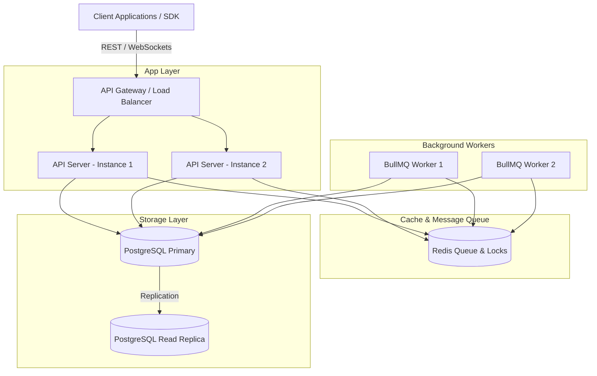

# JobFlow Production Readiness Review (PRR)

This document represents the final readiness review and threat model for deploying JobFlow v1.0 into enterprise production.

---

## 1. System Architecture Diagram

Below is the visual architecture representing the high-availability topology of JobFlow:

---

## 2. Threat Model (STRIDE)

We evaluated JobFlow against the STRIDE threat modeling framework to identify security risks and implement mitigations:

| STRIDE Threat | Potential Risk | Mitigation in JobFlow |
|---|---|---|
| **Spoofing Identity** | Malicious users calling internal APIs pretending to be administrators. | Enforced strict JWT authentication and hashed API keys in `authMiddleware`. |
| **Tampering with Data** | Attackers intercepting and modifying webhook payloads or database jobs. | Added Hmac SHA-256 signature verification for outbound and inbound webhooks. |
| **Repudiation** | An actor deletes/cancels a critical workflow and denies executing the action. | Compliance audit logs track every workflow start, cancellation, and API key rotation. |
| **Information Disclosure** | Database error stacks or secret variables leaking in HTTP response bodies. | Integrated global Express `errorMiddleware` sanitizing raw errors. Added Content Security Policy headers. |
| **Denial of Service** | Tenants overloading the system with millions of requests or jobs. | Enforced daily workflow quotas, concurrent limits, and Redis-based monthly API call rate limits. |
| **Elevation of Privilege** | Normal tenant users making administrative calls or modifying other tenants' resources. | Strictly isolated database requests via Tenant ID queries. Protected admin APIs with admin role validation. |

---

## 3. Scalability Checklist

- [x] **Stateless Servers:** API gateways and Express servers store no in-memory session state, allowing them to scale horizontally behind a load balancer.
- [x] **Dedicated Redis Connection Pooling:** Each queue, worker, and event listener gets a dedicated Redis connection to prevent multiplexing bottlenecking.
- [x] **Distributed Locking:** Concurrent execution ticks are synchronized via Redis-backed `DistributedLock` to prevent duplicate state evaluations.
- [x] **Rate Quotas:** Configurable limits prevent database exhaust due to infinite retry loops or runaway workflows.

---

## 4. Disaster Recovery (DR) Checklist

- **Recovery Point Objective (RPO):** < 1 hour (automatic transactional backups triggered hourly).
- **Recovery Time Objective (RTO):** < 15 minutes (using automated recovery scripts and warm-standby database replicas).

- [x] **Automated Backups:** Standard daily backup shell scripts dump Postgres databases and Redis memory snapshots.
- [x] **Restoration Validation:** Implemented `restore-validate.sh` validating SQL backup integrity inside temporary test containers prior to production deployment.
- [x] **Worker Auto-Recovery:** Restored worker nodes automatically reconcile database status on startup, resetting crashed running steps back to `PENDING` to resume from checkpoints.
- [x] **Dead Letter Queue:** Failed workflow jobs are preserved inside the `DeadLetterJob` table, allowing operator investigation and replay rather than silent deletion.
