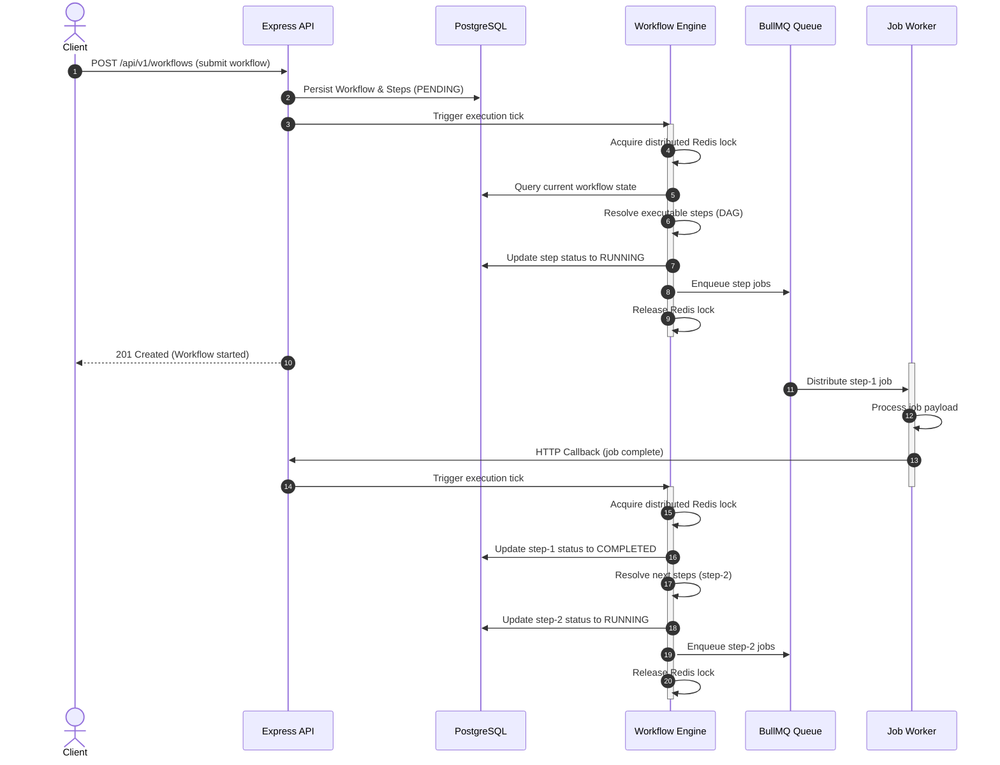

# Workflow Orchestration Engine

The Workflow Orchestration Engine is the core component that elevates JobFlow from a simple single-job processor to a full distributed workflow engine. It coordinates multiple execution steps represented as Directed Acyclic Graphs (DAGs) while keeping the underlying job execution fully decoupled.

---

## 1. Architectural Flow

In JobFlow, worker nodes never have visibility into the overall workflow sequence. They only execute single standalone jobs. The **Workflow Engine** coordinates when to schedule each job based on state transitions, resolving dependencies and conditions.

```text
        Client Submit
             │
             ▼
      +--------------+
      | Express API  |
      +------+-------+
             │
             ▼
     +-------+-------+
     |   PostgreSQL  | <---+ (Saves state, step results)
     +-------+-------+
             │
             ▼
     +-------+-------+
     |Workflow Engine| <---+ (Tick execution evaluation)
     +---+---+---+---+
         │   │   │
         │   │   +-------------------------+
         ▼   ▼                             ▼
   +-------------+                  +-------------+
   | Dependency  |                  |    Step     |
   |  Resolver   |                  |  Scheduler  |
   +-------------+                  +------+------+
                                           │
                                           ▼
                                    +------+------+
                                    | BullMQ Queue|
                                    +------+------+
                                           │ (Distributes tasks)
                                           ▼
                                    +------+------+
                                    |   Workers   |
                                    +------+------+
                                           │ (Publishes completion)
                                           ▼
                                    +------+------+
                                    |  Execution  |
                                    |  Callback   |
                                    +------+------+
                                           │
                                           ▼
                                  (Trigger next Tick)
```

---

## 2. Sequence Diagram

This sequence diagram illustrates how a client creates a workflow, how the engine schedules the first step, how the worker processes it, and how the completion of step 1 triggers the engine to schedule step 2.



---

## 3. Core Components

The engine is built of modular domain services under `src/modules/workflow/`:

### 1. Workflow Engine (`workflow.engine.ts`)
- **Ticks Loop**: Driven by events (workflow start, step completion, step failure, retry).
- **Concurrency Lock**: Uses a Redis distributed lock (`lock:workflow:tick:<id>`) during ticks to avoid race conditions when multiple parallel steps complete concurrently.
- **Worker Callbacks**: Exposes `handleStepCompletion` and `handleStepFailure` triggered by the background job execution handler.

### 2. Dependency Resolver (`dependency.resolver.ts`)
- **DAG Resolution**: Inspects the workflow graph to identify which steps are `PENDING` and have all parent dependencies `COMPLETED`.
- **Condition Evaluator**: Evaluates step expressions (e.g. `steps.<id>.status === 'COMPLETED'`) to dynamically decide if a path should run or be bypassed.
- **Cascading Cancellations**: Recursively marks downstream child steps as `CANCELLED` if a parent dependency path is skipped or failed.

### 3. Step Scheduler (`scheduler.ts`)
- Bridges workflows with BullMQ.
- Takes an executable step, creates a persistent Job database record, links it to the step, enqueues the job into BullMQ, and updates the step status to `RUNNING`.

### 4. State Machine (`state.machine.ts`)
- Enforces validity of workflow state transitions.

---

## 4. Tick Traversal Algorithm

The engine evaluates state using a traversal loop triggered on every workflow change:

1. **Acquire Distributed Lock**: Ensure single-threaded state evaluation for the workflow.
2. **Retrieve Current State**: Query the workflow and all steps (including associated jobs and run histories) from the database.
3. **Check Terminal State**: If the workflow is already `COMPLETED`, `FAILED`, or `CANCELLED`, release the lock and exit.
4. **Identify Ready Steps**: Pass steps to the `DependencyResolver` to find all eligible steps.
5. **Evaluate Conditions**:
   - If a step has a condition and the condition is **met**, schedule it.
   - If the condition is **not met**, transition the step to `CANCELLED` (skipped), calculate cascading cancellations for downstream dependent steps, and trigger a recursive tick.
6. **Schedule Executable Steps**: Call the `WorkflowScheduler` to enqueue jobs in BullMQ.
7. **Calculate Progress**: Compute the completion percentage (`progress = (finishedSteps / totalSteps) * 100`) and persist it.
8. **Evaluate Workflow Terminal Transition**:
   - If **all** steps are finished:
     * If any step failed ➡️ Transition workflow to `FAILED`.
     * Otherwise ➡️ Transition workflow to `COMPLETED`.
9. **Release Lock**.
