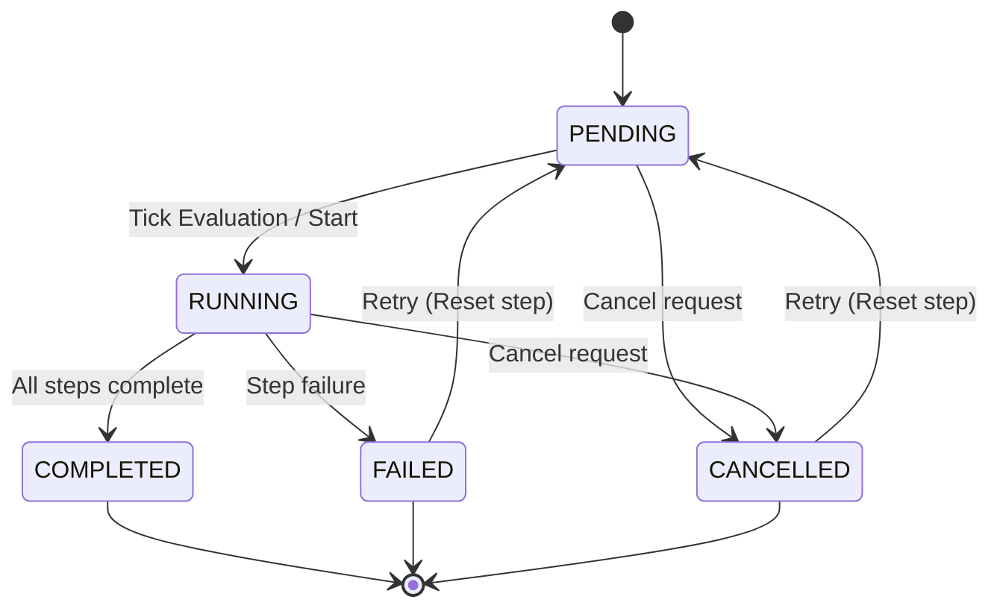

# Workflow & Step Lifecycle State Machine

JobFlow coordinates workflow orchestration using persistent state machine transitions. Both workflows and steps follow a strict state validation model to guarantee execution safety.

---

## 1. State Machine Schema

The states are defined by the `WorkflowStatus` enum:

```text
        +-----------+
        |  PENDING  |
        +-----+-----+
              │
              │ (Tick Evaluation / Start)
              ▼
        +-----------+
   +--->|  RUNNING  +------------+
   |    +-----+-----+            |
   |          │                  │
   | (Retry)  │ (All Completed)  │ (Failure / Cancel)
   |          ▼                  ▼
   |    +-----------+      +-----------+
   +----+  FAILED   |      | COMPLETED |
   |    +-----------+      +-----------+
   |          ▲
   | (Retry)  │ (Cancel)
   +----------+
              ▼
        +-----------+
        | CANCELLED |
        +-----------+
```

---

## 2. State Machine Diagram

This state transition diagram represents how both workflows and steps move through lifecycle states:



---

## 3. Transition Rules

The transition rules are defined in `state.machine.ts` and enforced at database update boundaries:

| From State | Allowed To States | Description |
|:---|:---|:---|
| **PENDING** | `RUNNING`, `CANCELLED` | Workflow/step is queued and waiting for initial scheduling or early cancellation. |
| **RUNNING** | `COMPLETED`, `FAILED`, `CANCELLED` | Job is executing in a worker. |
| **COMPLETED**| *(None - Terminal)* | Workflow/step finished successfully. |
| **FAILED** | `PENDING`, `RUNNING` | Step failed. Can transition back to `PENDING` during a retry. |
| **CANCELLED**| `PENDING`, `RUNNING` | Step/workflow was skipped or cancelled. Can be reset to `PENDING` on retry. |

---

## 4. Core Behaviors

### 1. Workflow Cancellation
When a user requests workflow cancellation (`PATCH /api/v1/workflows/:id/cancel`):
1. The workflow status transitions to `CANCELLED`.
2. All steps that are not in a terminal state (`COMPLETED`, `FAILED`, `CANCELLED`) are transitioned to `CANCELLED`.
3. The engine attempts to find the associated BullMQ job IDs for running steps and calls `job.remove()` to abort execution.
4. Run history is updated with audit logs: `"Step <id> cancelled by workflow termination."`
5. Progress is set to `100%`.

### 2. Selective Retry
When a workflow fails, JobFlow **does not restart the entire workflow**. It performs a selective retry (`POST /api/v1/workflows/:id/retry`):
1. Evaluates all steps and filters for those marked `FAILED` or `CANCELLED`.
2. Resets only those steps back to `PENDING` status, clearing `startedAt`, `completedAt`, and `jobId` database relations.
3. Sets the overall workflow status to `PENDING`.
4. Triggers `WorkflowEngine.tick()` to start executing from the exact points of failure, reusing all previously `COMPLETED` steps.
